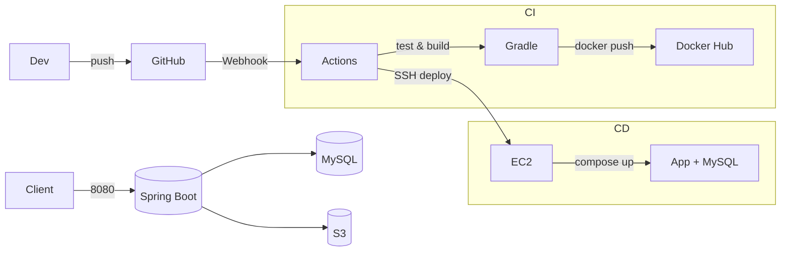
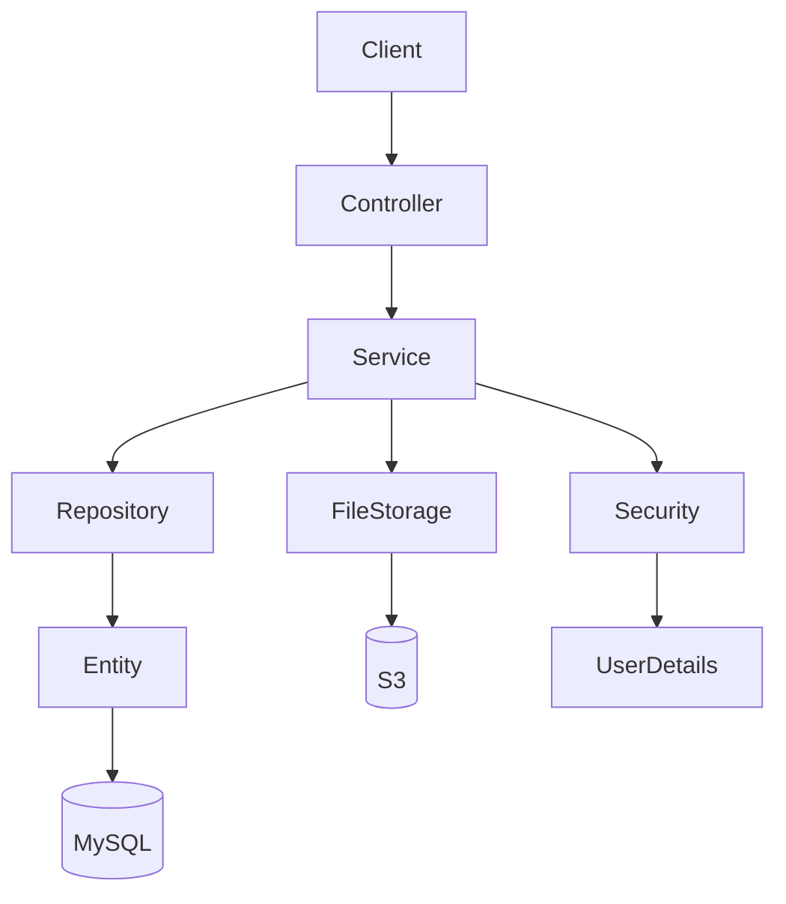
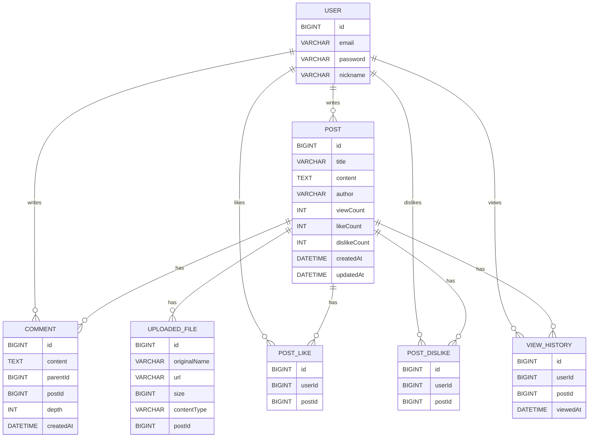

# 📘 Board-Service (Spring Boot 게시판 서비스)  
**JWT 인증 · 댓글/대댓글 · 좋아요/싫어요 · 조회수 중복 방지 · S3 파일 업로드 · CI/CD 자동 배포**

Spring Boot 기반으로 개발한 **JWT 인증 게시판 백엔드 서비스**입니다.  
게시글 CRUD, 댓글/대댓글, 좋아요/싫어요, 조회수 중복 방지, AWS S3 파일 업로드 등  
**실무 수준 기능**을 포함하고 있으며,  
GitHub Actions + Docker Hub + AWS EC2 기반 **완전 자동 CI/CD 배포 파이프라인**까지 구축했습니다.

본 프로젝트는 **신입 백엔드 포트폴리오 기준 업계 상용 수준**을 목표로 제작되었습니다.

---

# 🚀 주요 기능 요약

## 🔐 인증/인가 (Spring Security + JWT)
- 회원가입 / 로그인
- JWT 발급 & 인증 / 인가 필터 적용
- 인증된 사용자만 게시글/댓글 작성 가능
- SecurityContext 기반 권한 처리

---

## 📝 게시글 기능
- 게시글 생성 / 조회 / 수정 / 삭제
- **제목·내용·작성자 통합 검색**
- 정렬: 최신순 / 조회수 / 좋아요수
- **JPA Auditing**(생성일·수정일 자동 관리)
- **사용자별 조회수 1일 1회 증가**

---

## 💬 댓글/대댓글 기능
- 댓글 작성 / 대댓글 작성 / 삭제
- depth=1 대댓글 구조
- 게시글 삭제 시 댓글 cascade 삭제
- 트리 구조 응답 제공

---

## 👍 좋아요 / 싫어요
- 토글 방식 (누르면 +1 / 다시 누르면 취소)
- PostLike, PostDislike 테이블 기반 중복 방지
- 실시간 likeCount / dislikeCount 업데이트

---

## 📁 파일 업로드 (AWS S3)
- 게시글별 첨부파일 업로드
- S3 저장 후 public URL 반환
- 파일 경로 규칙:
```
posts/{postId}/{UUID}.ext
```
- 메타데이터 DB 저장  
  (url, originalName, size, contentType 등)

---

# 🔎 검색/정렬 기능
- keyword로 통합 검색 (title/content/author)
- 최신순 / 조회수 / 좋아요순 정렬 가능

---

# 🧪 테스트
- **PostLikeServiceTest**  
- **PostRepositoryTest**  
- **조회수 중복 방지 테스트**
- 통합 테스트: SpringBootTest + H2 test profile

---

# 🏛 아키텍처 구조





---

# 🗂 프로젝트 구조
```
src/main/java/com/example/board_service
 ├── auth
 ├── comment
 ├── config
 ├── controller
 ├── dislike
 ├── domain
 ├── dto
 ├── exception
 ├── file
 ├── like
 ├── repository
 ├── security
 └── service
```

---

# 📦 기술 스택

### Backend
- Java 21  
- Spring Boot 3.5.x  
- Spring Security  
- Spring Data JPA  
- MySQL 8  
- JWT  
- AWS S3 SDK  

### DevOps
- Docker / Docker Compose  
- AWS EC2  
- GitHub Actions (CI + CD)  
- Docker Hub Registry  

### Tools
- IntelliJ IDEA  
- GitHub / Git  

---

# 🗄 ERD 구조



---

# 📚 API 문서 (Swagger)
```
http://localhost:8080/swagger-ui/index.html
```

---

# 🌐 주요 API 예시

### 🔐 Auth
```
POST /api/auth/register
POST /api/auth/login
```

### 📝 Posts
```
POST   /api/posts
GET    /api/posts/{id}
PUT    /api/posts/{id}
DELETE /api/posts/{id}
```

### 🔎 Search & Sort
```
GET /api/posts?keyword=java&sort=latest
GET /api/posts?keyword=강의&sort=views
GET /api/posts?keyword=백엔드&sort=likes
```

### 📁 File Upload
```
POST /api/posts/{postId}/files
```

---

# ❗ 예외 처리 (GlobalExceptionHandler)
```json
{
  "timestamp": "2024-01-01T12:00:00",
  "status": 404,
  "error": "Not Found",
  "message": "게시글을 찾을 수 없습니다."
}
```

---

# 🔧 실행 방법

### 1) Docker Compose 실행
```
docker compose -f docker-compose.yml up -d
```

### 2) Spring Boot 실행
```
./gradlew bootRun
```

---

# 🚀 CI/CD (GitHub Actions + Docker Hub + AWS EC2)

## 🔵 CI
- `.github/workflows/ci.yml`
- 테스트(H2 test) + 빌드 자동화

## 🟢 CD
- `.github/workflows/deploy.yml`
- Docker 이미지 빌드 → Docker Hub 푸시  
- EC2 SSH 접속 후 자동 배포:
```bash
git pull origin main
docker compose -f docker-compose-prod.yml pull
docker compose -f docker-compose-prod.yml up -d
docker image prune -f
```

---

# 🎯 프로젝트 목표 달성도

| 기능 | 완료 여부 |
|------|-----------|
| JWT 인증 | ✅ |
| 게시글 CRUD | ✅ |
| 댓글/대댓글 | ✅ |
| 좋아요/싫어요 | ✅ |
| 조회수 중복 방지 | ✅ |
| 파일 업로드(S3) | ✅ |
| 검색/정렬 | ✅ |
| 테스트 코드 | 🔶 |
| Docker | ✅ |
| GitHub Actions CI | ✅ |
| GitHub Actions CD | ✅ |
| AWS EC2 배포 | ✅ |

---

# 🧠 설계 의도 & 핵심 포인트

1. **실무형 기능 위주 설계**
   - 단순 CRUD가 아니라, 실제 게시판 서비스에서 자주 요구되는
     - JWT 기반 로그인/권한 체크
     - 댓글/대댓글 구조
     - 좋아요/싫어요 토글
     - 조회수 중복 방지
     - 파일 업로드(S3)
     등을 모두 포함하도록 설계했습니다.

2. **엔티티/도메인 중심 설계**
   - `User`, `Post`, `Comment`, `UploadedFile`, `ViewHistory`, `PostLike`, `PostDislike` 등
     도메인 별로 역할을 분리하고, 연관관계를 ERD 기준으로 명확히 나눴습니다.
   - 조회수/좋아요 수는 집계 성능을 위해 `Post` 엔티티에 카운터 컬럼으로 유지하고,
     중복 체크는 별도 테이블(`ViewHistory`, `PostLike`, `PostDislike`)로 관리했습니다.

3. **테스트 가능한 구조**
   - 서비스/리포지토리를 분리하고, H2 기반 `test` 프로필을 분리해
     **로컬 MySQL과 테스트 환경을 완전히 독립**시켰습니다.
   - 좋아요/조회수 등의 비즈니스 로직은 **단위/통합 테스트**로 검증했습니다.

4. **운영 환경을 고려한 인프라**
   - Docker Compose로 `app + MySQL`을 한 번에 올릴 수 있게 구성.
   - `GitHub Actions → Docker Hub → EC2`로 이어지는
     **완전 자동 배포 파이프라인**을 구축해서,
     `main 브랜치 push = 운영 서버 자동 배포` 플로우를 만들었습니다.

---

# 🛠 트러블슈팅 경험

1. **테스트 환경과 운영 DB 설정 충돌 문제**
   - 문제: 로컬 MySQL 설정이 테스트 실행 시에도 사용되어, 스키마/데이터 충돌 발생.
   - 해결:
     - `application-test.yml`을 별도로 분리하고, H2 메모리 DB를 사용하도록 설정.
     - `@ActiveProfiles("test")` 기반 통합 테스트 환경을 구성하여
       **테스트와 운영 환경을 분리**했습니다.

2. **조회수 중복 증가 문제**
   - 문제: 동일 사용자가 게시글 상세 페이지를 새로고침할 때마다 `viewCount`가 증가.
   - 해결:
     - `ViewHistory` 엔티티를 도입해 `(userId, postId)` 기준으로 1일 1회만 기록.
     - 서비스 레벨에서 **기존 기록 여부 + 날짜**를 검증한 뒤,
       조건을 만족할 때만 `viewCount`를 증가시키도록 수정했습니다.

3. **EC2 + Docker 배포 시 애플리케이션 컨테이너 재시작 문제**
   - 문제: EC2에서 컨테이너는 떠 있는데 `/actuator/health`가 계속 실패하거나,
     코드 변경이 컨테이너에 반영되지 않는 문제 발생.
   - 해결:
     - `docker-compose-prod.yml`에서 이미지 태그를 Docker Hub 기준으로 정리.
     - EC2에 `.env.prod`를 두고, GitHub Actions에서
       `docker compose pull → up -d` 순서로 자동 배포하도록 설정.
     - 불필요한 로컬 빌드/컨테이너를 정리해 **CI/CD 기준 배포 플로우**로 통일했습니다.


# 👨‍💻 개발자
**이재욱 (Backend Developer)**

- Java/Spring Backend  
- Docker · AWS · DevOps  
- Unity 게임 개발 경험
